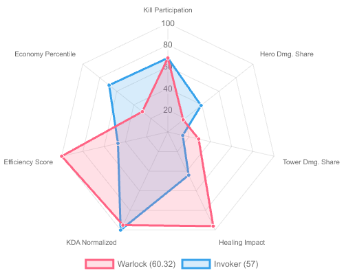

# 🎮 DotA 2 Match Result Notification System

> Automated match tracking, multi-platform notifications, AI-powered defeat analysis, and daily challenges — all for your DotA 2 stack.


---

## ✨ Key Features

### 🔍 Automated Match Polling
Polls the Steam API every minute for each registered member, fetches their latest 10 matches, and detects **party matches** — when multiple tracked members play together. Each match is notified only once with built-in duplicate prevention.

### 📱 Multi-Platform Notifications
Sends formatted match results to **WhatsApp** (via Fonnte) and **Telegram** (via Bot API). Each platform uses its own bot token and target, configured through the admin panel. Messages include hero picks, K/D/A stats, team outcomes, and MVP rankings.

### 🤖 AI Defeat Analysis
When a tracked party loses a match, an AI pipeline powered by **OpenAI LLM** analyzes the game data to determine *why* the match was lost. Structured diagnosis identifies loss types (execution, draft, scaling, etc.), enemy threats, and scaling patterns — all delivered in concise bullet points alongside the match notification.

### 🏆 Daily Challenge Engine
A dynamic challenge system with **30+ evaluator types** that runs daily. Challenges are randomly assigned with weighted selection, track progress across matches, and adapt difficulty on failure. Examples include:

- **Hero Challenge** — Win a game with a specific hero
- **Item Challenge** — Win a game where someone buys a specific item
- **Flawless Victory** — Win a game with zero deaths
- **Speedrun** — Win a game under a time threshold
- **Team Metrics** — Accumulate kills, assists, healing, or damage across matches

End-of-day review handles completion, failure escalation, and deferred reviews when OpenDota parsing is delayed.

### 📊 Fantasy Score / MVP Ranking
Each match calculates a **Fantasy Score** (0–100) for every tracked member using 7 weighted performance components: kill participation (25%), hero damage share (20%), KDA (15%), tower damage share (12%), economy percentile (10%), efficiency (10%), and healing impact (8%). MVP rankings are visualized with radar charts sent alongside notifications.



### 📈 Weekly Summary Reports
Every Monday, the system generates and sends a comprehensive weekly recap with:
- **Overall Stats** — Total matches, win rate, average duration
- **Weekly Awards** — MVP, best win rate, highest GPM, most hero/tower damage, best KDA
- **Individual Summaries** — Per-member breakdowns (WhatsApp only)

### 📰 News Tracking
Monitors official DotA 2 announcements from the **Steam news feed** and tracks **SteamDB game commits** via GitHub (`SteamDatabase/GameTracking-Dota2`). Sends notifications when significant updates are detected.

### 🛠️ Filament Admin Panel
A full admin panel built with **Filament** for managing:
- **Members** — Registered players with Steam IDs and display names
- **Destinations** — WhatsApp and Telegram bot tokens and targets
- **Settings** — Application configuration (key-value store)
- **Reminders** — Daily play limit warnings per member
- **News** — Steam and GitHub news records

---

## 🏗️ How It Works

```
1.  Every minute, the scheduler runs `matches:check`
2.  For each registered member, the system fetches their last 10 matches
    from the Steam API
3.  New matches are checked against the database — duplicates are skipped
4.  Members who played in the same match are grouped (party detection)
5.  A `ProcessMatchNotification` job is dispatched to format and send
    the result to all configured platforms
6.  If the party lost, the system requests OpenDota parsing, then runs
    the AI analysis pipeline once data is available
7.  Active daily challenges are evaluated against each new match
8.  At day-end, challenges are reviewed, scores are calculated, and
    results are sent
```

---

## 📋 Requirements

- **PHP** 8.2 or later (8.4 recommended)
- **MySQL** 8.0+ / PostgreSQL 14+
- **Composer** 2.x
- **Node.js** 18+ (for frontend asset building)
- **Steam API Key** — [Get one here](https://steamcommunity.com/dev/apikey) (free)
- **Fonnte Account** or **Telegram Bot** — Choose your messaging platform

---

## 🚀 Installation & Setup

### 1. Clone and Install Dependencies

```bash
git clone https://github.com/dotamatchresult/Dota-Match-Result.git
cd Dota-Match-Result
composer install
npm install && npm run build
```

### 2. Configure Environment

```bash
cp .env.example .env
php artisan key:generate
```

Update `.env` with your database credentials and API keys.

### 3. Set Up Database

```bash
php artisan migrate
```

### 4. Install Filament Admin Panel

```bash
php artisan filament:install --panels
php artisan make:filament-user
```

### 5. Seed Initial Data

```bash
php artisan db:seed
```

This seeds default settings, destinations (WhatsApp/Telegram), and challenge definitions.

### 6. Configure Destinations

Log in to the admin panel at `/admin` and navigate to **Destinations** to set:
- WhatsApp phone number and Fonnte API token
- Telegram bot token and chat/group ID

---

## ⚙️ Configuration

### Environment Variables

| Variable | Description |
|---|---|
| `STEAM_API_KEY` | Steam Web API key for fetching match history |
| `FONNTE_API_KEY` | Fonnte API key for WhatsApp messaging |
| `OPENAI_API_KEY` | OpenAI API key for AI defeat analysis |
| `OPENAI_MODEL` | GPT model (default: `gpt-5.4-mini`) |
| `AWS_ACCESS_KEY_ID` | AWS access key for image uploads (MVP charts) |
| `AWS_SECRET_ACCESS_KEY` | AWS secret key |
| `AWS_BUCKET` | S3 bucket name |
| `IMAGE_PREVIEW_URL` | Base URL for previewing uploaded images |

> **Note**: WhatsApp/Telegram phone numbers and bot tokens are managed through the **Destinations** section in the Filament admin panel, not in `.env`.

### Cron Configuration (Production)

Add to your server's crontab:

```bash
# Run Laravel scheduler every minute
* * * * * cd /path-to-project && php artisan schedule:run >> /dev/null 2>&1

# Process queued jobs every minute
* * * * * cd /path-to-project && php artisan queue:work --stop-when-empty --tries=3 --max-time=50 >> /dev/null 2>&1
```

### Daily Challenge Configuration

Challenge behavior is configured in `config/dota.php`:

| Setting | Default | Description |
|---|---|---|
| `daily_challenge.max_active_per_destination` | 5 | Max simultaneous challenges per platform |
| `daily_challenge.assignment_time` | `08:00` | When daily challenges are assigned |
| `daily_challenge.review_time` | `23:00` | When end-of-day review runs |
| `daily_challenge.review_force_after_hours` | 12 | Force review if OpenDota delays exceed this |
| `daily_challenge.assignment_history_days` | 14 | Days to avoid repeating the same challenge |

---

## 📨 Message Format

### Match Result Notification

```
🕹️ *Turbo* _(24 minutes)_

*Aldisaster, Kocrol, Bajindoel* won a game as Radiant

*Radiant* 37 ⚔️ 28 *Dire*

*Aldisaster* _(Queen of Pain)_ – 13/1/9
*Kocrol* _(Lion)_ – 3/12/15
*Bajindoel* _(Phantom Lancer)_ – 9/8/10

*Match ID* — 8662122936
```

Each message includes:
- **Match header** — Game mode and duration
- **Summary line** — Member names, win/loss, and team (Radiant/Dire)
- **Player stats** — Each member with their hero and K/D/A
- **Fantasy Score ranking** — Sorted MVP list with scores

### AI Analysis (Loss Matches Only)

When a tracked party loses, an AI-generated analysis is appended to the notification, identifying:
- Loss type classification (execution, draft, scaling, etc.)
- Key enemy threats and their impact
- Scaling trend pattern throughout the match
- Actionable bullet points

---

## 🧪 Testing

The project uses **Pest** for testing with comprehensive coverage:

```bash
# Run all tests
php artisan test --compact

# Run a specific test file
php artisan test --compact tests/Feature/MatchNotificationTest.php

# Filter by test name
php artisan test --compact --filter=it_detects_party_matches
```

### Test Structure

| Directory | Contents |
|---|---|
| `tests/Feature/` | End-to-end tests for commands, jobs, services, and the challenge engine |
| `tests/Unit/` | Unit tests for evaluators, MVP scoring, and individual services |
| `tests/Helpers/` | Test utilities and shared fixtures |

---

## 📚 Documentation

Additional documentation is available in the `docs/` directory:

| Document | Description |
|---|---|
| [Match Result Info](docs/MATCH_RESULT_INFO.md) | Detailed specification of match notification formatting |
| [Fantasy Score](docs/FANTASY_SCORE.md) | Technical documentation for the 7-component fantasy scoring system |
| [Weekly Summary](docs/WEEKLY_SUMMARY.md) | Weekly recap format, awards, and per-platform differences |
| [Challenge Authoring](docs/challenge-authoring.md) | Guide for creating new challenge definitions and evaluators |
| [AI Analysis Pipeline](docs/analysis/AGENTIC_LOSING_ANALYSIS.md) | Documentation for the 8-stage analysis pipeline |
| [Server Setup](docs/SERVER_SETUP.md) | Production deployment guide with environment requirements |
| [Daily Challenge Plan](docs/features/DAILY_CHALLENGE_PLAN.md) | Feature plan and architecture for the daily challenge system |

---

## License

This project is proprietary and intended for internal use only.

---

## Acknowledgments

This project is built on top of several excellent APIs and services:

- [Steam Web API](https://steamcommunity.com/dev) — Match history and player data
- [OpenDota](https://www.opendota.com/) — Match parsing and detailed game data
- [Fonnte](https://fonnte.com) — WhatsApp messaging gateway
- [Telegram Bot API](https://core.telegram.org/bots/api) — Telegram messaging
- [Laravel](https://laravel.com) — The PHP framework
- [Filament](https://filamentphp.com) — Admin panel framework
- [OpenAI](https://openai.com) — AI analysis via GPT
